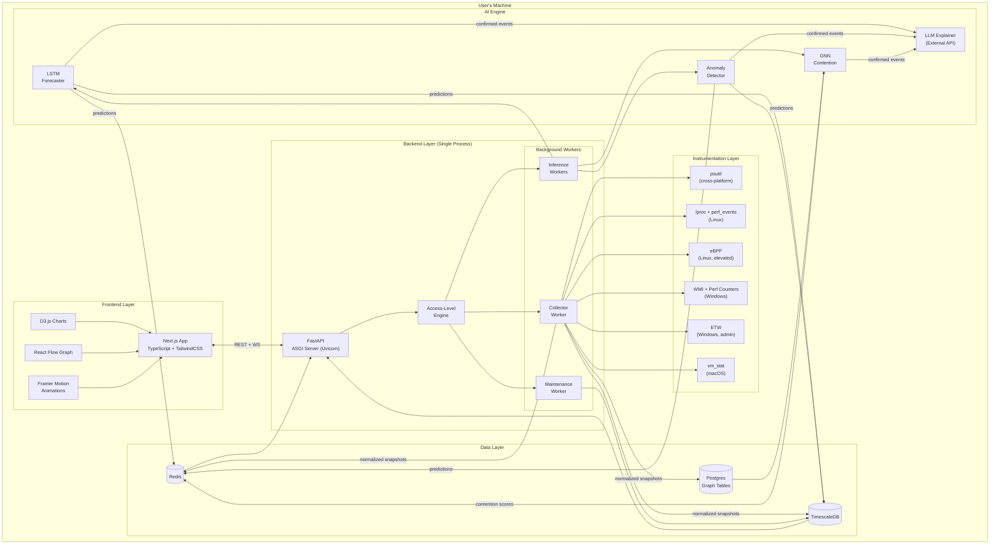
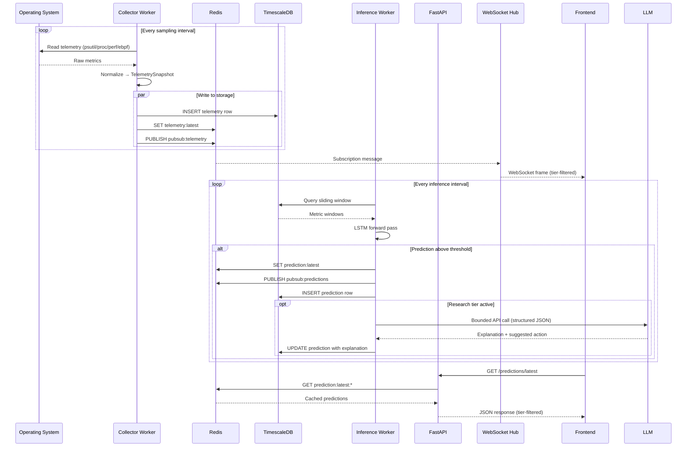
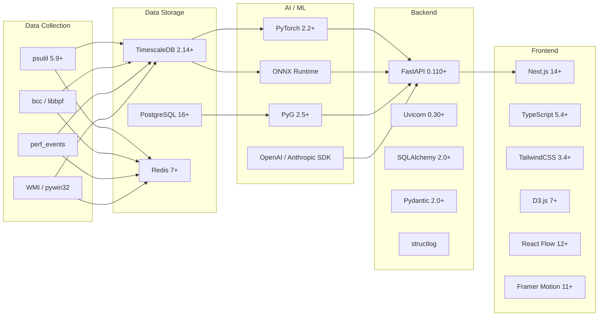
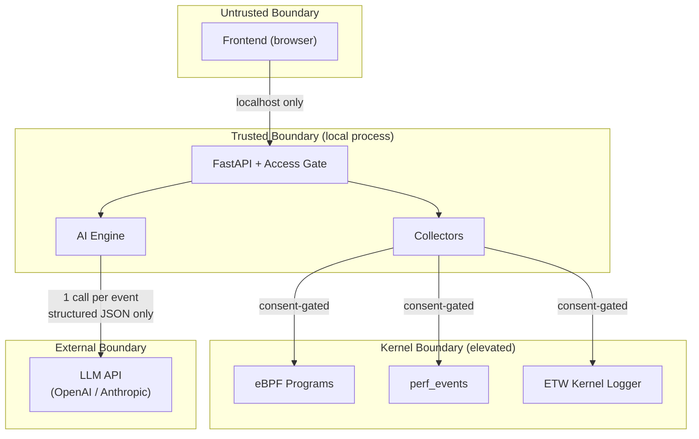

# KernelSense — Architecture Overview

> `docs/ARCHITECTURE.md` · v1.0 · 2026-07-05 · Prompt 3
>
> High-level architecture, component interaction model, and technology rationale.
> For detailed schemas and API contracts, see [SYSTEM_DESIGN.md](file:///c:/Users/GARV%20ANAND/Downloads/KernelSense/docs/SYSTEM_DESIGN.md).
> For ADRs, see [docs/adr/](file:///c:/Users/GARV%20ANAND/Downloads/KernelSense/docs/adr/).

---

## 1. Architecture Philosophy

KernelSense follows three architectural principles:

1. **Layered Isolation** — Each layer (instrumentation → storage → AI → API → frontend) communicates through well-defined interfaces. A failure in one layer degrades but does not crash the system.
2. **Progressive Disclosure** — Telemetry depth, AI features, and UI complexity increase only as the user explicitly opts in through the access-level model.
3. **Read-Only Safety** — The system observes but never modifies. Every component is designed with the assumption that KernelSense has zero write access to the OS it monitors.

---

## 2. Component Architecture



---

## 3. Layer Responsibilities

### Layer 1: Instrumentation

| Responsibility | Detail |
| :------------- | :----- |
| **Collect** | Poll or subscribe to OS telemetry APIs at the configured sampling rate |
| **Normalize** | Transform platform-specific data into the common `TelemetrySnapshot` schema |
| **Enrich** | Attach platform-specific extension fields (e.g., `linux.iowait`, `windows.disk_queue_length`) |
| **Detect** | Probe OS capabilities at startup; report maximum achievable tier |
| **Degrade** | On `AccessDenied` or unavailable API, skip and continue — never crash |

### Layer 2: Storage

| Responsibility | Detail |
| :------------- | :----- |
| **Ingest** | Write `TelemetrySnapshot` rows to TimescaleDB hypertable |
| **Retain** | Enforce rolling retention: raw (1–4h), downsampled (24h), compressed |
| **Graph** | Maintain process/resource adjacency lists in Postgres |
| **Cache** | Redis: latest snapshot, session tier state, pub/sub for WebSocket |

### Layer 3: AI Engine

| Responsibility | Detail |
| :------------- | :----- |
| **Forecast** | LSTM over sliding windows → saturation probability + ETA |
| **Detect** | Statistical + learned residual over memory growth curves → leak probability |
| **Correlate** | GNN over process/resource graph → contention/deadlock risk scores |
| **Explain** | Bounded LLM call: structured JSON in → plain-language out (1 call per event) |

### Layer 4: Backend API

| Responsibility | Detail |
| :------------- | :----- |
| **Serve** | REST endpoints for snapshots, history, predictions, access-level |
| **Stream** | WebSocket hub for real-time telemetry and prediction updates |
| **Gate** | Access-level middleware: enforce tier requirements on every request |
| **Orchestrate** | Manage background workers for collection, inference, maintenance |

### Layer 5: Frontend

| Responsibility | Detail |
| :------------- | :----- |
| **Visualize** | Kernel-ring dashboard, D3.js time-series charts, React Flow graph |
| **Interact** | Mode selector with consent dialogs for tier elevation |
| **Stream** | WebSocket consumer for real-time updates |
| **Degrade** | Hide unavailable metrics/visualizations based on current tier |

---

## 4. Communication Patterns



---

## 5. Technology Map



---

## 6. Failure Modes & Resilience

| Failure | Impact | Automatic Recovery |
| :------ | :----- | :----------------- |
| **psutil call fails** | Missing one snapshot | Skip, retry on next interval. Log warning. |
| **eBPF program load fails** | Research tier unavailable | Fall back to Power tier. Notify user via API. |
| **TimescaleDB connection lost** | No writes; reads fail | Retry with exponential backoff. Buffer to Redis (limited). |
| **Redis connection lost** | WebSocket stalls; cache miss | Fall back to direct DB reads. Reconnect. |
| **LSTM inference timeout** | No prediction for this cycle | Skip, retry on next cycle. Use last-known prediction. |
| **LLM API timeout (>5s)** | No explanation for this event | Use template-generated fallback explanation. |
| **GNN inference timeout** | No contention score | Skip. GNN is best-effort, non-critical. |
| **Frontend WebSocket drop** | UI freezes | Auto-reconnect with exponential backoff + jitter. |

---

## 7. Security Boundaries



| Boundary | Trust Level | Controls |
| :------- | :---------- | :------- |
| **Frontend → API** | Untrusted | Server-enforced tier gating; all validation server-side; localhost binding |
| **API → Collectors** | Trusted | Same process; capability-verified before activation |
| **Collectors → Kernel** | Consent-gated | Explicit user consent; capability check; read-only programs only |
| **AI → LLM** | External | Structured JSON only; no raw telemetry; timeout + fallback; no PII in payload |

---

## 8. Deployment Topology

```
┌──────────────────────────────────────────────────────┐
│  User's Machine                                       │
│                                                       │
│  ┌────────────────────────────────────────────────┐   │
│  │  kernelsense (single process)                  │   │
│  │  ├── Uvicorn ASGI server (:8000)               │   │
│  │  ├── Collector workers (asyncio tasks)         │   │
│  │  ├── Inference workers (asyncio tasks)         │   │
│  │  └── Maintenance worker (asyncio task)         │   │
│  └────────────┬───────────────┬───────────────────┘   │
│               │               │                       │
│  ┌────────────▼────────┐ ┌────▼─────────┐            │
│  │  TimescaleDB (:5432)│ │ Redis (:6379)│            │
│  │  (local or managed) │ │   (local)    │            │
│  └─────────────────────┘ └──────────────┘            │
│                                                       │
│  ┌────────────────────────────────────────────────┐   │
│  │  Next.js dev server (:3000)                    │   │
│  │  OR static build served by Uvicorn              │   │
│  └────────────────────────────────────────────────┘   │
│                                                       │
│  No Docker. No Kubernetes. No reverse proxy.          │
│  See ADR-0006 for rationale.                          │
└──────────────────────────────────────────────────────┘
```

---

## 9. ADR Index

| ADR | Title | Status |
| :-- | :---- | :----- |
| [0001](file:///c:/Users/GARV%20ANAND/Downloads/KernelSense/docs/adr/0001-storage-choice.md) | Storage Choice: TimescaleDB + Postgres + Redis | Accepted |
| [0002](file:///c:/Users/GARV%20ANAND/Downloads/KernelSense/docs/adr/0002-telemetry-strategy-cross-platform.md) | Telemetry Strategy: Cross-Platform Normalization | Accepted |
| [0003](file:///c:/Users/GARV%20ANAND/Downloads/KernelSense/docs/adr/0003-ai-model-choices.md) | AI Model Choices: LSTM + GNN + Statistical | Accepted |
| [0004](file:///c:/Users/GARV%20ANAND/Downloads/KernelSense/docs/adr/0004-llm-usage-boundary.md) | LLM Usage Boundary: Single Bounded Call | Accepted |
| [0005](file:///c:/Users/GARV%20ANAND/Downloads/KernelSense/docs/adr/0005-access-level-model-no-auth.md) | Access-Level Model: No Auth, Consent-Gated Tiers | Accepted |
| [0006](file:///c:/Users/GARV%20ANAND/Downloads/KernelSense/docs/adr/0006-deployment-strategy-no-docker.md) | Deployment Strategy: No Docker/Kubernetes | Accepted |
