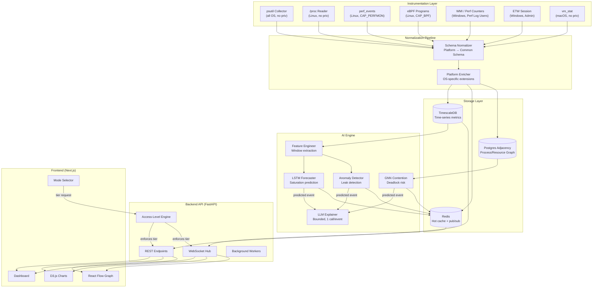
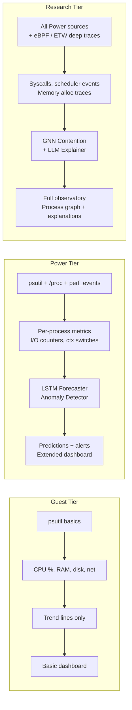
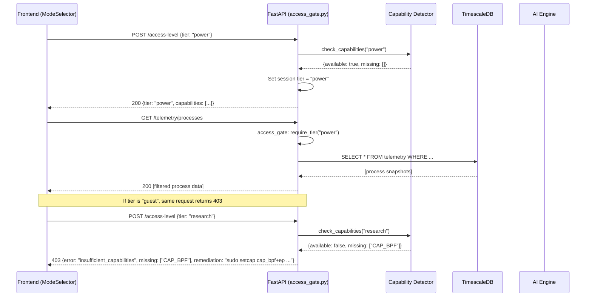
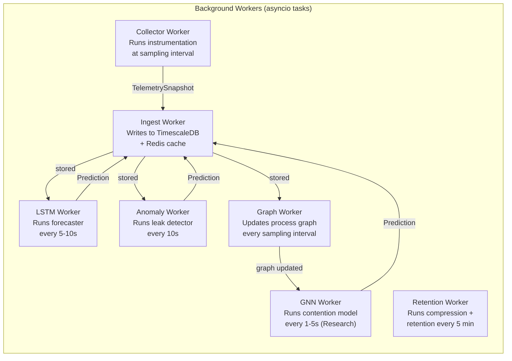

# KernelSense — System Design

> **[Post-Implementation Note (v1.0)]**: The physical system boundaries proposed below were strictly maintained. The only structural shift was shifting the Next.js UI component rendering strategy for high-frequency events. We utilized `next/dynamic` to lazy-load massive visualization libraries (`d3`, `framer-motion`) and mathematical binning to render 5,000+ context-switches/sec without crashing the React DOM.
> `docs/SYSTEM_DESIGN.md` · v1.0 · 2026-07-05 · Prompt 3
>
> Detailed data flow, component responsibilities, API contracts, and storage schemas.
> For high-level architecture, see [ARCHITECTURE.md](file:///c:/Users/GARV%20ANAND/Downloads/KernelSense/docs/ARCHITECTURE.md).
> For OS-concept-to-telemetry mapping, see [OPERATING_SYSTEM_ARCHITECTURE.md](file:///c:/Users/GARV%20ANAND/Downloads/KernelSense/docs/OPERATING_SYSTEM_ARCHITECTURE.md).

---

## 1. Full Pipeline — Mermaid Diagram



---

## 2. Data Flow — Per Access Level



### 2.1 Field Visibility by Tier

| Field Category              | Example Fields                                            | Guest | Power | Research |
| :-------------------------- | :-------------------------------------------------------- | :---- | :---- | :------- |
| **System-wide CPU**         | `cpu.percent`, `cpu.count`, `cpu.freq_mhz`                | ✅    | ✅    | ✅       |
| **System-wide Memory**      | `mem.total_bytes`, `mem.used_bytes`, `mem.percent`         | ✅    | ✅    | ✅       |
| **System-wide Disk**        | `disk.total_bytes`, `disk.used_bytes`, `disk.io_read_bytes`| ✅    | ✅    | ✅       |
| **System-wide Network**     | `net.bytes_sent`, `net.bytes_recv`, `net.connections`      | ✅    | ✅    | ✅       |
| **Per-process basic**       | `proc.pid`, `proc.name`, `proc.cpu_percent`, `proc.mem_rss`| ❌   | ✅    | ✅       |
| **Per-process I/O**         | `proc.io_read_bytes`, `proc.io_write_bytes`               | ❌    | ✅    | ✅       |
| **Per-process threads**     | `proc.num_threads`, `proc.ctx_switches_voluntary`         | ❌    | ✅    | ✅       |
| **Hardware counters**       | `hw.cpu_cycles`, `hw.cache_misses`, `hw.branch_misses`    | ❌    | ✅    | ✅       |
| **Software events**         | `sw.context_switches`, `sw.page_faults`, `sw.cpu_migrations`| ❌   | ✅    | ✅       |
| **Syscall traces**          | `ebpf.syscall_name`, `ebpf.syscall_latency_ns`            | ❌    | ❌    | ✅       |
| **Scheduler events**        | `ebpf.sched_switch`, `ebpf.sched_wakeup`, `ebpf.runqueue_latency_ns` | ❌ | ❌ | ✅  |
| **Memory allocation traces**| `ebpf.kmalloc_bytes`, `ebpf.page_alloc_order`             | ❌    | ❌    | ✅       |
| **Disk I/O traces**         | `ebpf.block_rq_issue`, `ebpf.block_rq_complete_ns`        | ❌    | ❌    | ✅       |
| **AI — Trend lines**        | `ai.cpu_trend`, `ai.mem_trend`                            | ✅    | ✅    | ✅       |
| **AI — Forecasts**          | `ai.cpu_saturation_eta`, `ai.mem_oom_probability`         | ❌    | ✅    | ✅       |
| **AI — Anomaly scores**     | `ai.leak_score`, `ai.anomalous_process_pid`               | ❌    | ✅    | ✅       |
| **AI — GNN contention**     | `ai.contention_score`, `ai.deadlock_risk`                 | ❌    | ❌    | ✅       |
| **AI — LLM explanations**   | `ai.explanation_text`, `ai.suggested_action`              | ❌    | ❌    | ✅       |

---

## 3. Component Responsibilities

### 3.1 Instrumentation Layer

```
backend/instrumentation/
├── base.py              # Abstract BaseCollector interface
├── schema.py            # TelemetrySnapshot, ProcessSnapshot dataclasses
├── normalizer.py        # Platform → common schema normalization
├── psutil_collector.py  # Cross-platform psutil-based collector
├── linux/
│   ├── proc_reader.py   # /proc filesystem reader
│   ├── perf_collector.py# perf_events interface
│   └── ebpf_collector.py# eBPF program loader + event reader
├── windows/
│   ├── wmi_collector.py # WMI queries
│   ├── perf_counter.py  # Performance counter reader
│   └── etw_collector.py # ETW session manager
└── macos/
    └── vmstat_reader.py # vm_stat parser
```

**Responsibilities:**
- Collect raw telemetry from OS-specific APIs at a configurable sampling interval.
- Normalize all data into the common `TelemetrySnapshot` schema before emitting.
- Detect available OS capabilities at startup and map to the maximum achievable tier.
- Never block — collectors run in dedicated threads/async tasks with timeouts.
- Gracefully degrade on `AccessDenied` — log, skip, and continue with available data.

### 3.2 Storage Layer

```
backend/storage/
├── timescale.py         # TimescaleDB connection, hypertable management
├── retention.py         # Rolling retention policy, continuous aggregates
├── graph_store.py       # Process/resource graph (Postgres adjacency)
├── redis_cache.py       # Redis hot cache, pub/sub for WebSocket fan-out
└── models.py            # SQLAlchemy ORM models
```

**Responsibilities:**
- **TimescaleDB:** Ingest `TelemetrySnapshot` rows, manage hypertable partitioning, enforce retention (raw: 1–4h, downsampled: 24h), run compression jobs.
- **Graph Store:** Maintain a live adjacency-list representation of process → resource relationships (which process has which files open, which PIDs communicate via IPC, parent-child trees). Updated every sampling interval.
- **Redis:** Store the latest metric snapshot for each source (O(1) lookup for the frontend), publish updates to WebSocket subscribers, cache AI prediction results.

### 3.3 AI Engine

```
backend/ai/
├── feature_eng.py       # Window extraction, feature normalization
├── forecaster.py        # LSTM-based time-series forecasting
├── anomaly.py           # Statistical + learned residual anomaly detector
├── gnn_contention.py    # GNN over process/resource graph
├── llm_explainer.py     # Bounded LLM call wrapper
├── models/              # Trained model weights (ONNX format)
└── inference_worker.py  # Background inference loop
```

**Responsibilities:**
- **Feature Engineering:** Extract sliding windows from TimescaleDB (configurable: 60s–300s), normalize features per metric dimension, handle missing values (masked arrays for cross-platform gaps).
- **LSTM Forecaster:** Predict per-resource saturation probability and ETA. One model per resource class (CPU, memory, I/O). Runs every 5–10s. Outputs: `{resource, probability, eta_seconds, confidence}`.
- **Anomaly Detector:** Monitor per-process memory growth curves. Combines a statistical baseline (exponentially weighted moving average + z-score) with a learned residual model. Runs every 10s. Outputs: `{pid, process_name, leak_probability, growth_rate_bytes_per_sec}`.
- **GNN Contention:** Build a graph snapshot from the graph store, run message-passing GNN (2–3 layers, ~500 nodes), output per-node contention score. Runs every 1–5s. Post-MVP.
- **LLM Explainer:** Receives a structured JSON event (`{event_type, resource, process, metrics, prediction}`) and produces a plain-language explanation + suggested action. Exactly one call per confirmed predicted event. Timeout: 5s. Fallback: template-generated explanation.

### 3.4 Backend API

```
backend/api/
├── main.py              # FastAPI application factory
├── routers/
│   ├── telemetry.py     # GET /telemetry/snapshot, /telemetry/history
│   ├── processes.py     # GET /processes, /processes/{pid}
│   ├── predictions.py   # GET /predictions/latest, /predictions/history
│   ├── access_level.py  # GET/POST /access-level
│   └── health.py        # GET /health
├── websocket/
│   ├── hub.py           # WebSocket connection manager
│   └── stream.py        # Real-time telemetry + prediction streaming
├── middleware/
│   ├── access_gate.py   # Access-level enforcement middleware
│   └── error_handler.py # Structured error responses
├── deps.py              # Dependency injection (DB, Redis, AI engine)
└── config.py            # Pydantic Settings
```

**Responsibilities:**
- Serve REST endpoints for telemetry snapshots, process lists, prediction results, and access-level management.
- Manage WebSocket connections for real-time streaming (telemetry updates + prediction events).
- Enforce access-level gating in middleware — **every request is checked** against the current tier before reaching the handler.
- Run background workers for AI inference loops (LSTM, anomaly, GNN).
- Structured JSON error responses with remediation hints (e.g., "This endpoint requires Power tier. To upgrade, POST /access-level with tier='power'.").

### 3.5 Frontend

```
frontend/
├── src/
│   ├── app/              # Next.js app directory
│   │   ├── page.tsx      # Dashboard home
│   │   ├── layout.tsx    # Root layout with kernel-ring chrome
│   │   └── processes/    # Process detail view
│   ├── components/
│   │   ├── KernelRing.tsx       # Animated ring visualization
│   │   ├── ResourceGauge.tsx    # CPU/mem/disk/net gauges
│   │   ├── TimeSeriesChart.tsx  # D3.js time-series chart
│   │   ├── ProcessGraph.tsx     # React Flow dependency graph
│   │   ├── PredictionCard.tsx   # AI prediction display
│   │   ├── ModeSelector.tsx     # Guest/Power/Research selector
│   │   └── ConsentDialog.tsx    # Elevation consent modal
│   ├── hooks/
│   │   ├── useWebSocket.ts      # WebSocket connection hook
│   │   ├── useTelemetry.ts      # Telemetry data hook
│   │   └── useAccessLevel.ts    # Access level state hook
│   ├── lib/
│   │   ├── api.ts               # REST API client
│   │   └── schema.ts            # TypeScript types matching backend schema
│   └── styles/
│       └── globals.css          # Kernel-ring / glassmorphism design system
```

---

## 4. Access-Level Enforcement Model

### 4.1 Enforcement Architecture



### 4.2 Enforcement Rules

| Rule | Implementation |
| :--- | :------------- |
| **Server-side only** | `access_gate.py` middleware checks `request.state.tier` before every handler. Frontend tier selector is a convenience — it does not control data access. |
| **Capability verification** | Before granting a tier, the backend probes the OS for required capabilities (`CAP_BPF`, `CAP_PERFMON`, `perf_event_paranoid`, WMI group membership). Tier is only granted if capabilities are verified. |
| **Field-level filtering** | REST responses and WebSocket messages are filtered through a `TierFieldFilter` that strips fields not visible at the current tier (see Section 2.1). |
| **Endpoint-level gating** | Certain endpoints (`/telemetry/syscalls`, `/telemetry/scheduler`, `/predictions/contention`, `/predictions/explain`) are Research-only. Middleware returns 403 with structured error. |
| **No persistence** | Tier state is per-session (in-memory). Restarting the backend resets to Guest. No cookies, no tokens, no stored preferences. |
| **Consent logging** | Every tier elevation is logged to structured logs with timestamp, requested tier, and capability verification result. |

### 4.3 Capability Detection — Per OS

```python
# Pseudocode: capability_detector.py

def detect_max_tier() -> AccessTier:
    if platform == "linux":
        if has_cap("CAP_BPF") and has_cap("CAP_PERFMON"):
            return RESEARCH
        elif perf_event_paranoid() <= 1 or has_cap("CAP_PERFMON"):
            return POWER
        else:
            return GUEST

    elif platform == "windows":
        if is_admin():
            return RESEARCH
        elif in_group("Performance Monitor Users"):
            return POWER
        else:
            return GUEST

    elif platform == "darwin":
        return GUEST  # macOS is always Guest-only
```

---

## 5. Storage Schema

### 5.1 TimescaleDB — Telemetry Hypertable

```sql
-- Core time-series table (hypertable)
CREATE TABLE telemetry (
    ts          TIMESTAMPTZ NOT NULL,
    host_id     TEXT NOT NULL DEFAULT 'local',
    tier        TEXT NOT NULL,  -- 'guest', 'power', 'research'

    -- System-wide CPU
    cpu_percent         DOUBLE PRECISION,
    cpu_count           INTEGER,
    cpu_freq_mhz        DOUBLE PRECISION,
    cpu_user_percent    DOUBLE PRECISION,
    cpu_system_percent  DOUBLE PRECISION,
    cpu_iowait_percent  DOUBLE PRECISION,  -- Linux only, NULL on others

    -- System-wide Memory
    mem_total_bytes     BIGINT,
    mem_used_bytes      BIGINT,
    mem_available_bytes BIGINT,
    mem_percent         DOUBLE PRECISION,
    mem_swap_total      BIGINT,
    mem_swap_used       BIGINT,

    -- System-wide Disk (aggregated)
    disk_read_bytes     BIGINT,
    disk_write_bytes    BIGINT,
    disk_read_count     BIGINT,
    disk_write_count    BIGINT,

    -- System-wide Network (aggregated)
    net_bytes_sent      BIGINT,
    net_bytes_recv      BIGINT,
    net_packets_sent    BIGINT,
    net_packets_recv    BIGINT,
    net_connections      INTEGER,

    -- Software events (Power+)
    sw_ctx_switches     BIGINT,
    sw_page_faults      BIGINT,
    sw_cpu_migrations   BIGINT,

    -- Hardware counters (Power+)
    hw_cpu_cycles       BIGINT,
    hw_cache_misses     BIGINT,
    hw_branch_misses    BIGINT
);

SELECT create_hypertable('telemetry', 'ts');

-- Retention policy: drop raw data older than 4 hours
SELECT add_retention_policy('telemetry', INTERVAL '4 hours');

-- Continuous aggregate: 1-minute rollups for 24h view
CREATE MATERIALIZED VIEW telemetry_1m
WITH (timescaledb.continuous) AS
SELECT
    time_bucket('1 minute', ts) AS bucket,
    host_id,
    AVG(cpu_percent) AS cpu_percent_avg,
    MAX(cpu_percent) AS cpu_percent_max,
    AVG(mem_percent) AS mem_percent_avg,
    MAX(mem_percent) AS mem_percent_max,
    SUM(disk_read_bytes) AS disk_read_bytes_sum,
    SUM(disk_write_bytes) AS disk_write_bytes_sum,
    SUM(net_bytes_sent) AS net_bytes_sent_sum,
    SUM(net_bytes_recv) AS net_bytes_recv_sum
FROM telemetry
GROUP BY bucket, host_id;
```

### 5.2 Per-Process Telemetry (Power+)

```sql
CREATE TABLE process_telemetry (
    ts              TIMESTAMPTZ NOT NULL,
    pid             INTEGER NOT NULL,
    name            TEXT,
    status          TEXT,
    cpu_percent     DOUBLE PRECISION,
    mem_rss_bytes   BIGINT,
    mem_vms_bytes   BIGINT,
    mem_percent     DOUBLE PRECISION,
    num_threads     INTEGER,
    num_fds         INTEGER,
    io_read_bytes   BIGINT,
    io_write_bytes  BIGINT,
    ctx_switches_voluntary   BIGINT,
    ctx_switches_involuntary BIGINT,
    parent_pid      INTEGER
);

SELECT create_hypertable('process_telemetry', 'ts');
SELECT add_retention_policy('process_telemetry', INTERVAL '2 hours');
```

### 5.3 eBPF Event Stream (Research)

```sql
CREATE TABLE ebpf_events (
    ts              TIMESTAMPTZ NOT NULL,
    event_type      TEXT NOT NULL,  -- 'syscall', 'sched_switch', 'page_alloc', 'block_rq'
    pid             INTEGER,
    tid             INTEGER,
    comm            TEXT,           -- process command name
    -- Syscall fields
    syscall_name    TEXT,
    syscall_latency_ns BIGINT,
    -- Scheduler fields
    prev_pid        INTEGER,
    next_pid        INTEGER,
    runqueue_latency_ns BIGINT,
    -- Memory fields
    alloc_bytes     BIGINT,
    alloc_order     INTEGER,
    -- Block I/O fields
    block_dev       TEXT,
    block_sector    BIGINT,
    block_bytes     INTEGER,
    block_latency_ns BIGINT
);

SELECT create_hypertable('ebpf_events', 'ts');
SELECT add_retention_policy('ebpf_events', INTERVAL '1 hour');
```

### 5.4 Process-Resource Graph (Postgres Adjacency)

```sql
-- Nodes: processes and resources
CREATE TABLE graph_nodes (
    id          SERIAL PRIMARY KEY,
    node_type   TEXT NOT NULL,  -- 'process', 'file', 'socket', 'pipe', 'shm'
    node_key    TEXT NOT NULL UNIQUE,  -- 'proc:1234', 'file:/var/log/syslog', 'socket:127.0.0.1:8080'
    label       TEXT,
    metadata    JSONB,
    last_seen   TIMESTAMPTZ DEFAULT NOW()
);

-- Edges: relationships
CREATE TABLE graph_edges (
    id          SERIAL PRIMARY KEY,
    source_key  TEXT NOT NULL REFERENCES graph_nodes(node_key),
    target_key  TEXT NOT NULL REFERENCES graph_nodes(node_key),
    edge_type   TEXT NOT NULL,  -- 'open_file', 'ipc_pipe', 'ipc_socket', 'parent_child', 'shared_memory'
    weight      DOUBLE PRECISION DEFAULT 1.0,
    metadata    JSONB,
    last_seen   TIMESTAMPTZ DEFAULT NOW()
);

CREATE INDEX idx_graph_edges_source ON graph_edges(source_key);
CREATE INDEX idx_graph_edges_target ON graph_edges(target_key);
```

### 5.5 AI Predictions

```sql
CREATE TABLE predictions (
    ts              TIMESTAMPTZ NOT NULL,
    prediction_type TEXT NOT NULL,  -- 'saturation', 'anomaly', 'contention', 'explanation'
    resource        TEXT,           -- 'cpu', 'memory', 'disk', 'io'
    pid             INTEGER,
    process_name    TEXT,
    probability     DOUBLE PRECISION,
    eta_seconds     DOUBLE PRECISION,
    confidence      DOUBLE PRECISION,
    details         JSONB,         -- model-specific output
    explanation     TEXT,          -- LLM-generated, NULL until populated
    suggested_action TEXT          -- LLM-generated, NULL until populated
);

SELECT create_hypertable('predictions', 'ts');
SELECT add_retention_policy('predictions', INTERVAL '24 hours');
```

---

## 6. API Contract Summary

### 6.1 REST Endpoints

| Method | Path                          | Tier     | Description                                      |
| :----- | :---------------------------- | :------- | :----------------------------------------------- |
| GET    | `/health`                     | Any      | Health check, current tier, uptime                |
| GET    | `/access-level`               | Any      | Current tier + available capabilities              |
| POST   | `/access-level`               | Any      | Request tier elevation (triggers capability check) |
| GET    | `/telemetry/snapshot`         | Guest+   | Latest system-wide metrics                         |
| GET    | `/telemetry/history`          | Guest+   | Historical metrics (uses continuous aggregates)    |
| GET    | `/telemetry/processes`        | Power+   | Per-process telemetry snapshots                    |
| GET    | `/telemetry/processes/{pid}`  | Power+   | Single process detail + history                    |
| GET    | `/telemetry/syscalls`         | Research | eBPF syscall trace events                          |
| GET    | `/telemetry/scheduler`        | Research | eBPF scheduler events                              |
| GET    | `/predictions/latest`         | Power+   | Latest AI predictions                              |
| GET    | `/predictions/history`        | Power+   | Historical predictions                             |
| GET    | `/predictions/contention`     | Research | GNN contention scores                              |
| GET    | `/predictions/explain/{id}`   | Research | LLM explanation for a specific prediction          |
| GET    | `/graph/snapshot`             | Research | Current process/resource graph                     |

### 6.2 WebSocket Channels

| Channel                    | Tier     | Payload                                  | Frequency     |
| :------------------------- | :------- | :--------------------------------------- | :------------ |
| `ws://host/ws/telemetry`   | Guest+   | `TelemetrySnapshot` (tier-filtered)      | 1–10 Hz (configurable) |
| `ws://host/ws/processes`   | Power+   | `ProcessSnapshot[]` (top N by CPU/mem)   | 1–5 Hz        |
| `ws://host/ws/predictions` | Power+   | `Prediction` events as they occur        | Event-driven  |
| `ws://host/ws/ebpf`        | Research | `EbpfEvent` stream                       | Event-driven  |

### 6.3 Error Response Format

```json
{
    "error": "insufficient_tier",
    "required_tier": "power",
    "current_tier": "guest",
    "remediation": "POST /access-level with {\"tier\": \"power\"}. Requires perf_event_paranoid <= 1 or CAP_PERFMON.",
    "missing_capabilities": ["CAP_PERFMON"]
}
```

---

## 7. Redis Cache Strategy

| Key Pattern                    | Value                              | TTL     | Purpose                            |
| :----------------------------- | :--------------------------------- | :------ | :--------------------------------- |
| `telemetry:latest`             | Serialized `TelemetrySnapshot`     | 5s      | Hot-path for WebSocket broadcast   |
| `process:latest:{pid}`         | Serialized `ProcessSnapshot`       | 5s      | Quick process lookup               |
| `prediction:latest:{type}`     | Serialized `Prediction`            | 30s     | Latest prediction per type         |
| `graph:snapshot`               | Serialized graph adjacency         | 10s     | Graph for GNN input                |
| `tier:session:{session_id}`    | `"guest"`, `"power"`, `"research"` | 1h      | Session tier state                 |
| `pubsub:telemetry`             | Channel                            | N/A     | Pub/sub for WebSocket fan-out      |
| `pubsub:predictions`           | Channel                            | N/A     | Pub/sub for prediction events      |

---

## 8. Background Worker Architecture



All workers are `asyncio.Task` instances managed by the FastAPI lifespan. They communicate via Redis pub/sub and shared asyncio queues. Each worker has independent error handling — a failing GNN worker does not affect the collector or forecaster.

---

## 9. Sampling Rate Configuration

| Tier     | Default Rate | Configurable Range | Rationale                                         |
| :------- | :----------- | :----------------- | :------------------------------------------------ |
| Guest    | 1 Hz         | 0.5–2 Hz           | Minimal overhead, sufficient for trend lines       |
| Power    | 2 Hz         | 1–5 Hz             | Enough resolution for per-process tracking         |
| Research | 5 Hz         | 2–10 Hz            | High resolution for eBPF event correlation         |

eBPF events are **not** sampled — they are collected as they occur (event-driven) and rate-limited at the eBPF program level to prevent overwhelming the pipeline.
